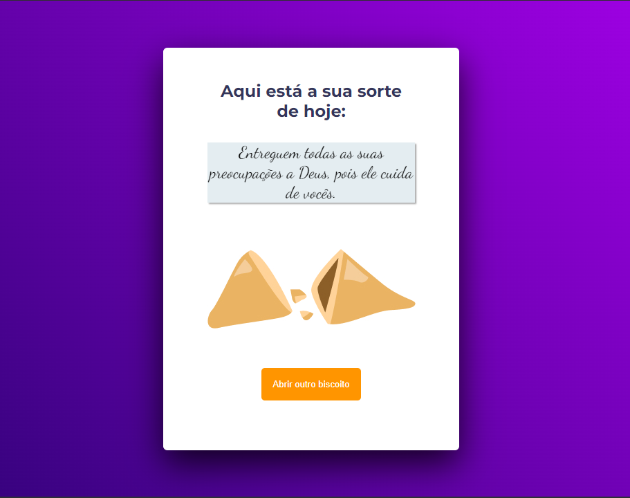

# Uso do JavaScript | Curso Explorer

### Essa tarefa faz parte do curso Explorer da [Rocketseat](https://www.rocketseat.com.br).

Nessa atividade foram abordadas as seguintes questões:

- Estrutura de dados HTML;
- Animações com o CSS;
- Funções no JS;
- Manipulação da DOM;
- Arrays

## 🔖 Layout 

O figma do projeto está disponível nesse [Link](<https://www.figma.com/file/Qt2c5gjuOR7ecqmHY6HpwE/Biscoito-da-Sorte-(Community)?node-id=0%3A1&mode=dev>).

## 👩‍💻 Demonstração

Que tal verificar como está sua sorte hoje? [Clique Aqui!](<https://codepen.io/Dayane-Fernandes/pen/dywZVWJ>)
